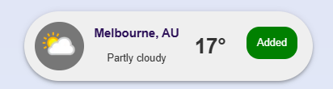
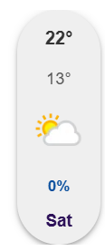
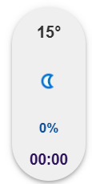
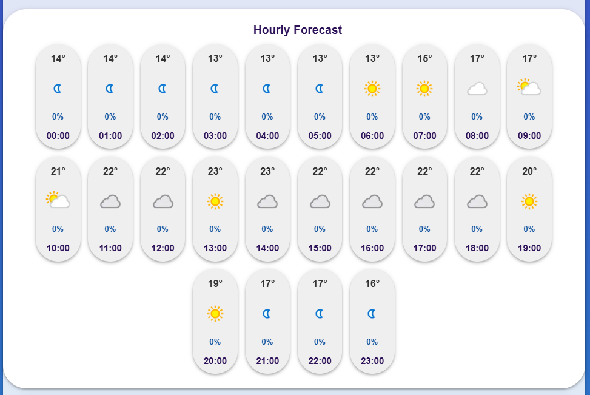
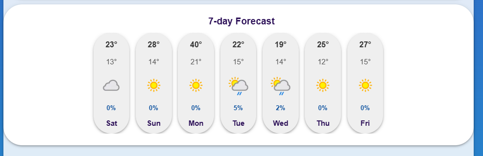

# WeatherWise 🌤️

WeatherWise is a React-based weather forecast application that allows users to search for cities and view real-time weather conditions, hourly forecasts, and 7-day forecasts using a public Weather API.

The goal of this project was to build a responsive frontend application that consumes an external API, manages state effectively, and provides a clean and intuitive user experience.

---

## 🚀 Live Demo

[Open WeatherWise](https://weather-wizards.netlify.app/)

---

## Features

- **Current Conditions**: Displays current temperature, humidity, wind speed, and weather conditions with intuitive icons.
- **Hourly Forecast**: Hour-by-hour forecast for the current day to help plan your day.
- **Daily Forecast**: 7-day forecast with high and low temperatures, precipitation chances, and condition icons.
- **Location Search**: Search and save your favorite locations for quick access.
- **Local Storage**: Saves cities locally without the need for a database.
- **Default Behavior**:
  - Auto-detects location based on IP or precise location with permission.
---

## 🛠️ Tech Stack

- React (JavaScript)
- Vite
- CSS
- Weather API (external REST API)
- LocalStorage
- ESLint

---

## Cards

- **Glance Cards**:
  - Weather icon
  - Location name and country
  - Weather condition (e.g., Partly Cloudy, Clear)
  - Temperature (Celsius)
---

### City Card

- Displays glanceable weather information for a city

### Day Card


- Showcases the daily forecast

### Hour Card



- Showcases the current conditions or a forecast for a specific hour

Includes:

- Current or high temperature
- Precipitation chances
- Condition icons


### Hourly Forecast


- A list of Hour Cards for the current day


### Seven Day Forecast



- A list of Day Cards for today and the next 6 days

## Pages

### Home

- Displays the search bar and closest city.
- Displays current weather conditions using a City Card.
- Displays search results as City Cards.

### Details

- Provides comprehensive weather information for a selected location.

Includes:

- Location name
- Weather condition with icon
- Temperature
- Feels like temperature
- High & low temperatures
- Hourly and future forecasts
- Precipitation chance
- Wind speed
- Sunrise & sunset times
- UV Index
- Humidity & dew point
- Pressure (inHg)


### Saved Cities

- Allows users to view and manage their saved locations.
- Users can then navigate to the details page for any saved location.

## 🧠 Technical Highlights

- Component-based architecture (CityCard, DayCard, HourCard, etc.)
- Reusable UI components
- API data fetching using async/await
- State management with React Hooks (`useState`, `useEffect`)
- Conditional rendering for loading and error states
- Persistent client-side storage with LocalStorage
- Clean project structure and separation of concerns

---
## ⚙️ Installation & Setup

Clone the repository and run the project locally:

```bash
git clone https://github.com/danilo90lan/WeatherWise_ForecastApp_WebAPI.git
cd WeatherWise_ForecastApp_WebAPI
npm install
npm run dev
```

Then open the local development URL shown in the terminal:

```
http://localhost:5173
```


## 🔮 Future Improvements

- Migrate to TypeScript for improved type safety
- Add unit and integration tests
- Implement loading skeleton components
- Improve API error messaging
- Add caching strategy for API responses
- Add dark mode support
- Convert to Next.js for SSR support

---

## 📌 Notes

This project was originally developed as part of a collaborative learning experience.  
This repository reflects my maintained and structured version of the application.

---

## 👨‍💻 Author

Danilo Lannocca